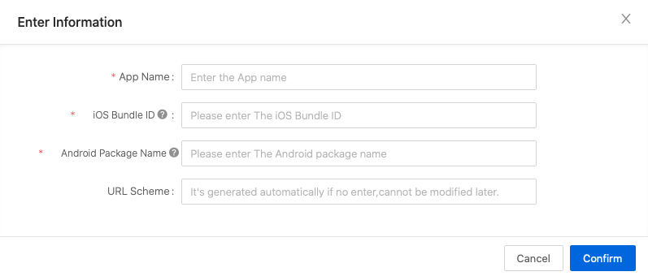
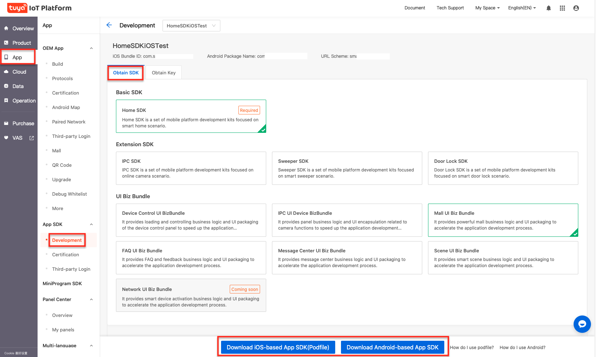
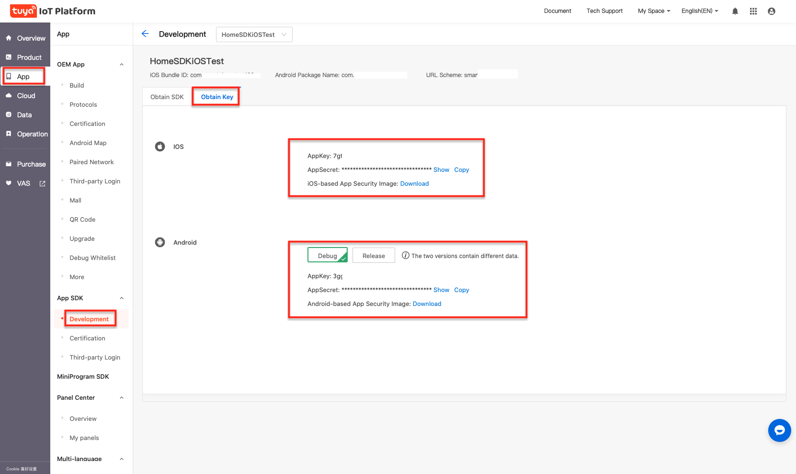

# Preparation for Integration
First, you need to go to the Wiser Smart IoT Platform to register a developer account, create products and create function points, etc. Please refer to the Create Products for details.

## Procedure

1. Log in to the App SDK page on the IoT Platform

	>**Note**: if you do not have a Wiser account, register first.

2. On the sidebar at the left of the **IoT Platform**, click **App** and select **Development**. Then click **Create**.

	

4. Enter app-related information and then click **OK**.

	- **App name**: enter the App name.
	- **iOS Bundle ID**: enter the iOS app bundle ID. The recommended format is `com.xxxxx.xxxxx`.
	- **Android Package Name**: enter the Android app package name. It is not necessary to be consistent with the iOS bundle ID.
	- **URL Scheme**: it is not required. If it is not entered, the system will automatically generate one channel ID according to the package name.

	

5. You can choose the option you need according to actual needs, support multiple selections, and then integrate the SDK according to Podfile and Gradle.

	

6. Click **Obtain Key** to get SDK AppKey, AppSecret, security picture, and other information.

	