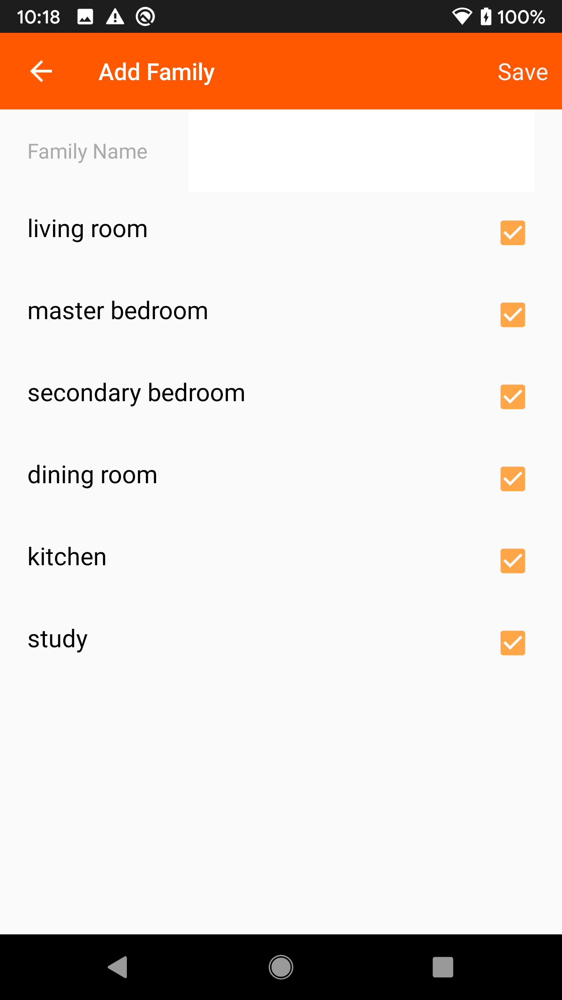

# Demo App
## Introduction

Demo APP mainly demonstrates the SDK development process. Before developing the APP, it is recommended to complete the operation of the Demo App according to this document.

After completing the [Preparation for Integration](https://tuyainc.github.io/tuyasmart_home_android_sdk_doc/en/resource/Preparation.html) chapter, you will get the AppKey, AppSecret, and security picture information used by the SDK. When integrating the SDK, please confirm that the AppKey, AppSecret, and security pictures are consistent with the information on the platform. Any mismatch will cause the SDK to be unusable.

[Click to view Demo address🔗](https://github.com/TuyaInc/tuyasmart_home_android_sdk/tree/master/WiserSmartHomeSdkDemo)

1. Replace the `applicationId` in the `build.gradle` file in the app directory with the package name of your application 


2. Name your security picture: "t_s.bmp" and put it in the "src"-"main"-"assets" folder under the app directory


3. Fill your AppKey and AppSecret into the corresponding `<meta-data>` tags in `AndroidManifest.xml`


Then click run to run your demo

## Function Overview:

Demo App includes:

- User module: Account (mobile phone or email) registration and login
- Home management and device management module: including home creation and current home switching. Display of device list and control of device function point in home. Device rename and device removal.
- Device activator module: including smartConfig mode, AP mode, wired gateway distribution network and gateway sub device activator
- Smart scene module: smart scene creation and execution



##  Q&A

**API interface request prompt signature error**

```json
{
  "success" : false,
  "errorCode" : "SING_VALIDATE_FALED",
  "status" : "error",
  "errorMsg" : "Permission Verification Failed",
  "t" : 1583208740059
}
```

* Please check whether your AppKey, AppSecret and Security Picture are configured correctly and are consistent with those obtained in the  [Preparation for Integration](https://tuyainc.github.io/tuyasmart_home_android_sdk_doc/en/resource/Preparation.html) chapter
* Please check whether the security picture in the correct directory and the file name: t_s.bmp
