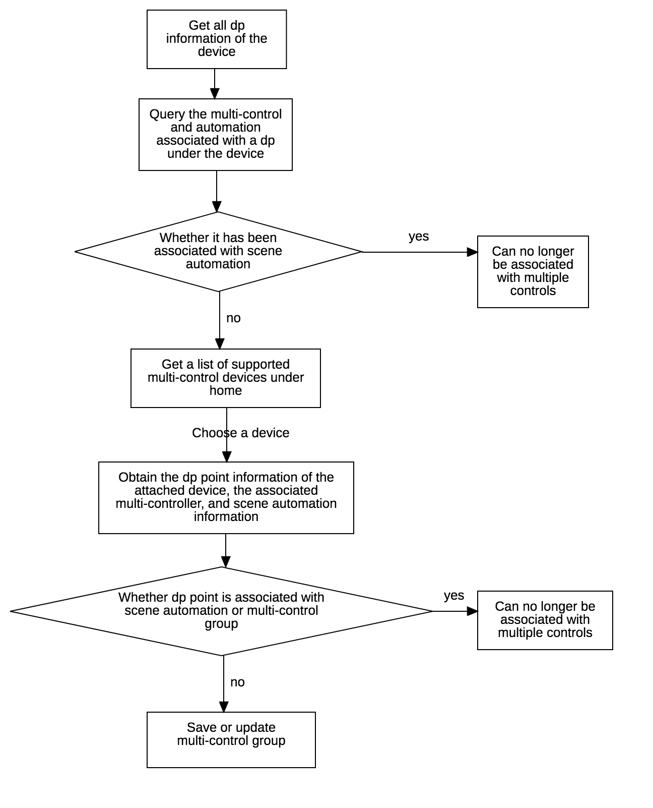

# Multi-control Association

## Overview

Multi-device control refers to the establishment of an association between the device dp and the device dp to generate a multi-control group. When controlling a device that establishes a dp association in the multi-control group, the status of the dp points associated with other devices in the group is synchronized.

For example: three two-way zigbee sub-device switches, the first dp point of each switch and the first dp point of the other two switches establish a multi-control group, when the first dp state of one of the switches is closed , The first dp of the other two switches are closed synchronously.

**Currently supports zigbee sub-device, mesh sub-device type switches**

**Support cross pid**

**Attention:**  The current restriction on dpCode is switch\_number, sub\_switch\_number type dp

## Function Entrance


```java
IWiserDeviceMultiControl iWiserDeviceMultiControl = WiserHomeSdk.getDeviceMultiControlInstance();

```

## Business Flowchart



## Get Device Dp Information

**Interface Description**

```java
void getDeviceDpInfoList(String devId, IWiserDataCallback<ArrayList<DeviceDpInfoBean>> callback);

```

**Parameter Description**

| Parameter | Description |
| :--- | :--- |
| devId | Device id |
| callback | Callback for getting results |


**Sample Code**

```java
IWiserDeviceMultiControl iWiserDeviceMultiControl = WiserHomeSdk.getDeviceMultiControlInstance();
iWiserDeviceMultiControl.getDeviceDpInfoList(mDevId, new IWiserDataCallback<ArrayList<DeviceDpInfoBean>>() {
    @Override
    public void onSuccess(ArrayList<DeviceDpInfoBean> result) {
        
    }

    @Override
    public void onError(String errorCode, String errorMessage) {
        ToastUtil.shortToast(mContext,errorMessage);
    }
});

```

## Query Related Information of a Dp 

**Interface Description**

We call the multi-control and automation main device related to querying the current device dp, and other devices related to the returned data are auxiliary devices

```java
void queryLinkInfoByDp(String devId, String dpId, IWiserDataCallback<MultiControlLinkBean> callback);

```

**Parameter Description**

| Parameter | Description |
| :--- | :--- |
| devId | Device id |
| dpId | Device dp id|
| callback | Callback for getting results |


**Sample Code**

```java

iWiserDeviceMultiControl.queryLinkInfoByDp(mDevId, dpId, new IWiserDataCallback<MultiControlLinkBean>() {
    @Override
    public void onSuccess(MultiControlLinkBean result) {
        
    }

    @Override
    public void onError(String errorCode, String errorMessage) {
        ToastUtil.shortToast(mContext,errorMessage);
    }
});

```

**MultiControlLinkBean Information**

| Field | Type | Description |
| :--- | :--- | :--- |
| multiGroup | MultiControlLinkBean.MultiGroupBean  | Associated multi-control group data structure|
| parentRules | List<MultiControlLinkBean.ParentRulesBean> | Associated scene automation data structure

**MultiControlLinkBean.MultiGroupBean Information**

| Field | Type | Description |
| :--- | :--- | :--- |
| uid | String | User id |
| groupName | String | Multi-control group name |
| groupType | int | Multi-control group type (Fixed is 1) |
| multiRuleId | String | |
| id | int | |
| ownerId | String | Family id |
| enabled | boolean | Whether to open the multi-control group |
| status | int |  |
| groupDetail | List<GroupDetailBean> | Multi-control group information|


**GroupDetailBean Information** 

| Field | Type | Description |
| :--- | :--- | :--- |
| devId | String | Accessory device id |
| dpName | String | Dp name of the associated auxiliary device|
| multiControlId | int | Multi-control group id|
| dpId | int | Dp id of the associated attached device |
| devName | String | The name of the associated accessory device |
| enabled | boolean | Whether the associated auxiliary equipment can be controlled by the multi-control function |
| status | int |  |
| datapoints | List<MultiControlDataPointsBean> | dp information|


**MultiControlDataPointsBean Information** 

| Field | Type | Description |
| :--- | :--- | :--- |
| code | String | dp point standard name（dpCode）|
| dpId | int | dp id |
| name | String | dp name|


**ParentRulesBean Information**

| Field | Type | Description |
| :--- | :--- | :--- |
| id | String | Automation id |
| name | String| Automation name |


##Add,Update,Delete Multi-controll Groups

**Interface Description**

 - Two overloading methods are provided, and the multi-control group can be updated through json format data, or MultiControlBean can also be used. Through this interface, you can add other devices to the master device to enter the multi-control group. You can update the name of the multi-control group, update the devices of the multi-control group, and delete the devices of the multi-control group.
 - Add a new multi-control group without sending multi-control group id
 - Adding a new multi-control group is to associate the dp of the auxiliary device with the main device dp, so the GroupDetail must contain the device information of the main device
 - Deleting a multi-control group requires GroupDetail to be empty

```java
void saveDeviceMultiControl(long mHomeId, MultiControlBean multiControlBean, IWiserResultCallback<MultiControlBean> callback);

void saveDeviceMultiControl(long mHomeId, String json, IWiserResultCallback<MultiControlBean> callback);

```

**Parameter Description**

| Parameter | Description |
| :--- | :--- |
| mHomeId | Home id |
| MultiControlBean | Multi-control group data structure |
| json | Multi-control group data structure|
| callback | Callback for getting results |

The complete data structure of json is as follows:

```json
{
    "groupName":"Mulit-control 1",
    "groupType":1,
    "groupDetail":[{"devId":"adadwfw3e234ferf41","dpId":2, "id":22, "enable":true}],
    "id":22         //  Mulit-control Id
}          

```

**Sample Code**

```java

iWiserDeviceMultiControl.saveDeviceMultiControl(Constant.HOME_ID, multiControlBean, new IWiserResultCallback<MultiControlBean>() {
    @Override
    public void onSuccess(MultiControlBean result) {
        ToastUtil.shortToast(mContext,"success");
    }

    @Override
    public void onError(String errorCode, String errorMessage) {
        ToastUtil.shortToast(mContext,errorMessage);
    }
});

```

**MultiControlBean Information**

| Field | Type | Optional| Description |
| :--- | :--- | :--- | :--- |
| groupName| String| Yes|Multi-control group name|
| groupType | int |No| Multi-control group type，must pass 1|
| groupDetail| List<GroupDetailBean>| Yes | Multi-control group equipment information|
| id |int |Yes| Multi-control group id|


## Enable or Disable Multi-control Group


**Interface Description**

```java
void enableMultiControl(long multiControlId, IWiserResultCallback<Boolean> callback);

void disableMultiControl(long multiControlId, IWiserResultCallback<Boolean> callback);
```

**Parameter Description**

| Parameter | Description |
| :--- | :--- |
| multiControlId | Multi-control group id |
| callback |  |


**Sample Code**


```java
iWiserDeviceMultiControl.enableMultiControl(id, new IWiserResultCallback<Boolean>() {
    @Override
    public void onSuccess(Boolean result) {
        ToastUtil.shortToast(mContext,"success");
    }

    @Override
    public void onError(String errorCode, String errorMessage) {
        ToastUtil.shortToast(mContext,errorMessage);
    }
});

iWiserDeviceMultiControl.disableMultiControl( id, new IWiserResultCallback<Boolean>() {
    @Override
    public void onSuccess(Boolean result) {
        ToastUtil.shortToast(mContext,"success");
    }

    @Override
    public void onError(String errorCode, String errorMessage) {
        ToastUtil.shortToast(mContext,errorMessage);
    }
});

```

## Query Devices that Support Multi-control

**Interface Description**

```java
void getMultiControlDeviceList(long mHomeId,  IWiserDataCallback<ArrayList<MultiControlDevInfoBean>> callback);

```

**Parameter Description**

| Field | Type | Description |
| :--- | :--- | :--- |
| mHomeId| long| home id|
| callback| Object | Callback for getting results|

**Sample Code**

```java
iWiserDeviceMultiControl.getMultiControlDeviceList(Constant.HOME_ID, new IWiserDataCallback<ArrayList<MultiControlDevInfoBean>>() {
    @Override
    public void onSuccess(ArrayList<MultiControlDevInfoBean> result) {
        iMultiControlDeviceView.setData(result);
    }

    @Override
    public void onError(String errorCode, String errorMessage) {
        ToastUtil.shortToast(mContext,errorMessage);
    }
});

```

**MultiControlDevInfoBean Information**

| Field | Type | Description |
| :--- | :--- | :--- |
| productId | String | Product id|
| devId | String | Device id|
| iconUrl | String | Device icon url |
| name | String | Device name|
| roomName | String | Room name |
| inRule | boolean | Whether it has already been connected |
| datapoints | List<MultiControlDataPointsBean> | dp point information|

## Get Affiliate Device Details

**Interface Description**

```java
void getDeviceDpLinkRelation(String devId, IWiserDataCallback<DeviceMultiControlRelationBean> callback);
```

**Parameter Description**

| Field | Type | Description |
| :--- | :--- | :--- |
| devId | String|Device id |
| callback |Object|Callback for getting results |


**Sample Code**

```java

iWiserDeviceMultiControl.getDeviceDpLinkRelation(devId, new IWiserDataCallback<DeviceMultiControlRelationBean>() {
    @Override
    public void onSuccess(DeviceMultiControlRelationBean result) {
        L.d("MultiControlDeviceListPresenter",result.toString());
    }

    @Override
    public void onError(String errorCode, String errorMessage) {
        ToastUtil.shortToast(mContext,errorMessage);
    }
});

```

**DeviceMultiControlRelationBean Information**


| Field | Type | Description |
| :--- | :--- | :--- |
| datapoints | List<MultiControlDataPointsBean> | dp point information|
| mcGroups | List<McGroupsBean> | Related multi-controller information|
| parentRules |List<ParentRulesBean> | Associated scene automation information|

