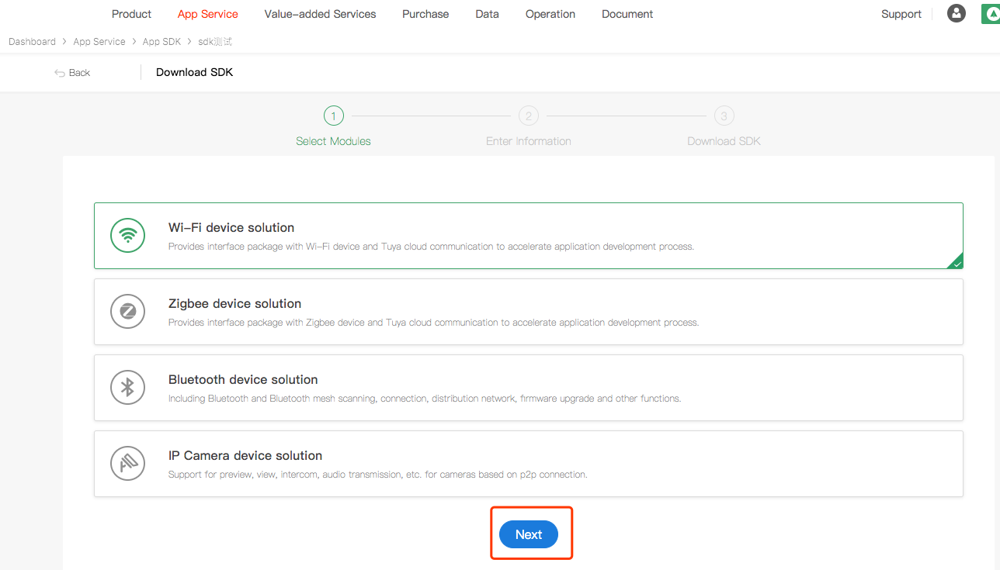
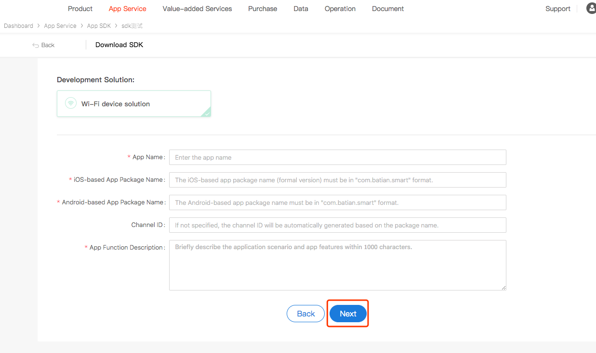
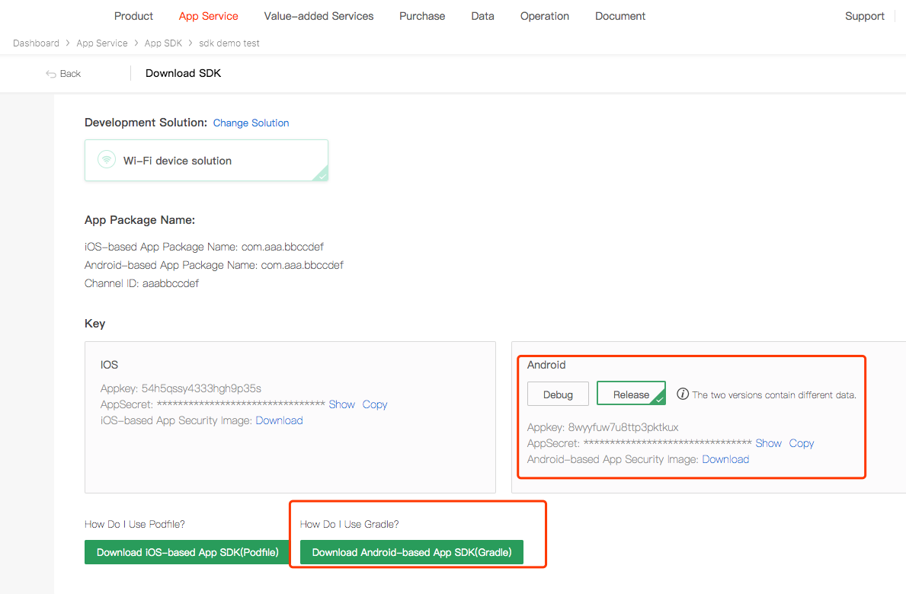

# Preparation for Integration

## Register Wiser Developer Account
Go to the [Wiser Smart Development](https://auth.tuya.com/) Platform to register a developer account, create products and create function points, etc. Please refer to the [Contact workflow](https://docs.tuya.com/zh/iot/device-intelligentize-in-5-minutes/device-intelligentize-in-5-minutes) for details.
## Create an SDK APP

1. Got to [Wiser IoT platform](https://iot.tuya.com/)
2. Click "App Service" - "App SDK" - "Obtain SDK" in order on the iot platform.
3. Select the feature according to your needs and click "Next".

3. Enter the created app information as prompted and click "Next".

	

4. AppKey, AppSecret can be obtained in the Android section. Click "Download" and " Download Android-based App SDK(Gradle)" to download the required security images and dependencies.

	
