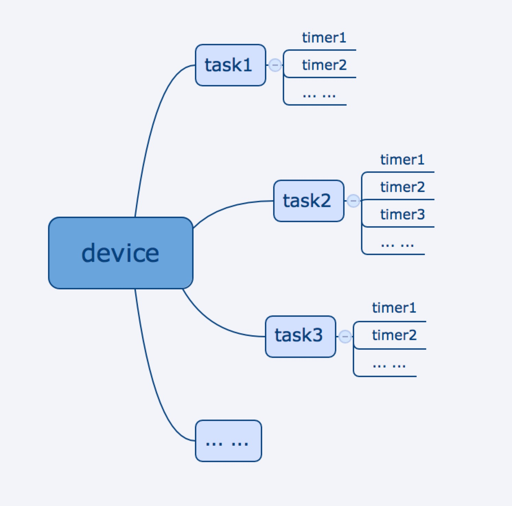

# Timer Task

Wiser Smart provides basic timing capabilities, and supports devices (including WiFi devices, Bluetooth mesh sub-devices and zigbee sub-devices) and groups. It is also provided with the interface for addition, deletion, change and querying of timer information for dp points of the device. After the APP sets the timer information through the timing interface, the hardware module automatically performs the scheduled operation according to the timing requirements. Multiple timers can be included in each timer task, as shown in the figure below:



All methods related to timing are included in WiserHomeSdk.getTimerManagerInstance().

The taskName is used by multiple interfaces, which can be described as a group, and a group may include multiple timers. Each timer task belongs to or does not belong to a group, and the group is currently only used for presentation.

## Add Timer Task

We provide two methods to implement adding a timer.The first one is only supports single dp point and the second supports HashMap as a parameter.

**Declaration**

Add one timer.

```java
void addTimerWithTask(String taskName, String devId, String loops, Map<String, Object> dps, String time, final IResultStatusCallback callback);

void addTimerWithTask(String taskName, String devId, String loops, Map<String, Object> dps, String time, boolean isAppPush, String remark, final IResultStatusCallback callback);
```


**Parameters**

| Parameters        | Description                                            |
| ----------- | ----------------------------------------------- |
| taskName | Name of timer task                             |
| devId    | Device Id or group Id|
| loops | Execute the timer times of a week.number of loops: "0000000”; 0 denotes off, and 1 denotes on. Each 0 from the left to the right denotes: Sunday, Monday, Tuesday, Wednesday, Thursday, Friday and Saturday, respectively."0000000" means execute once."1111111" means execute everyday                               |
| dps		 | A key-value pair consisting of dpId and dpValue.For example: "14:00" |
| time		 | Time clock in a timer task.For example:"14:00".Currently only supports 24-hour format|
| isAppPush | Is support push message after the timer executed (The app must be supported FCM)|
| remark | The timer remark name |
| callback | callback not null|


**Example**

```java
WiserHomeSdk.getTimerManagerInstance().addTimerWithTask("task01", "1111111",mDevId,  "{"1":true}", "14:29", new IResultStatusCallback() {
    @Override
    public void onSuccess() {
        Toast.makeText(mContext, "adding timer tasks succeeded", Toast.LENGTH_LONG).show();
    }

    @Override
    public void onError(String errorCode, String errorMsg) {
        Toast.makeText(mContext, "adding timer tasks failed " + errorMsg, Toast.LENGTH_LONG).show();
    }
});
```

## Obtain Status of Timer Task

**Declaration**

Obtain states of all timer tasks of a certain device.

```java
void getTimerTaskStatusWithDeviceId(String devId, final IGetDeviceTimerStatusCallback callback);

```

**Parameters**

| Parameters        | Description                                            |
| ----------- | ----------------------------------------------- |
| devId    | Device Id or group Id|
| callback | callback not null|


**Example**

```java
WiserHomeSdk.getTimerManagerInstance().getTimerTaskStatusWithDeviceId(mDevId, new IGetDeviceTimerStatusCallback() {
    @Override
    public void onSuccess(ArrayList<TimerTaskStatus> list) {
        Toast.makeText(mContext, “obtaining states of timer tasks of a device succeeded", Toast.LENGTH_LONG).show();
    }
    @Override
    public void onError(String errorCode, String errorMsg) {
        Toast.makeText(mContext, "obtaining states of timer tasks of a device failed" + errorMsg, Toast.LENGTH_LONG).show();
    }

});
```


## Update the Status of Timer

**Declaration**

Control switch status of a timer.

```java
void updateTimerStatusWithTask(String taskName, String devId, String timerId, boolean isOpen, IResultStatusCallback callback);
```

**Parameters**

| Parameters        | Description                                            |
| ----------- | ----------------------------------------------- |
| taskName | Name of timer task  |                           
| devId    | Device Id or group Id|
| status 	 | Status value 1: on; 0: off |
| callback | callback not null|


**Example**

```java
WiserHomeSdk.getTimerManagerInstance().updateTimerStatusWithTask(taskName, mDevId, timeId, false, new IResultStatusCallback() {
        @Override
        public void onSuccess() {
            Toast.makeText(mContext, "controlling switch status of a timer succeeded", Toast.LENGTH_LONG).show();
        }

        @Override
        public void onError(String errorCode, String errorMsg) {
            Toast.makeText(mContext, "controlling switch status of a timer failed" + errorMsg, Toast.LENGTH_LONG).show();
        }
    });
```
## Remove Timer

**Declaration**

Remove a timer

```java
void removeTimerWithTask(String taskName, String devId, String timerId, IResultStatusCallback callback);
```
**Parameters**

| Parameters        | Description                                            |
| ----------- | ----------------------------------------------- |
| taskName | Name of timer task  |                           
| devId    | Device Id or group Id|
| timerId 	 | Time clock Id |
| callback | callback not null|


**Example**

```java
WiserHomeSdk.getTimerManagerInstance().removeTimerWithTask(taskName, mDevId, timeId, new IResultStatusCallback() {
    @Override
    public void onSuccess() {

       Toast.makeText(mContext, "removing timer succeeded", Toast.LENGTH_LONG).show();
    }

    @Override
    public void onError(String errorCode, String errorMsg) {
        Toast.makeText(mContext, "removing timer failed" + errorMsg, Toast.LENGTH_LONG).show();
    }

});
```
## Update Timer 

We provide two methods to implement update a timer.The first is the old one ,only support single dp point,the other support multiply dp points.


**Declaration**

Updating timer status (this interface can modify all attributes of a timer).

```java
void updateTimerWithTask(String taskName, String loops, String devId, String timerId, String instruct, final IResultStatusCallback callback);

void updateTimerWithTask(String taskName, String loops, String devId, String timerId, String instruct, boolean isAppPush, String remark, final IResultStatusCallback callback);

```

**Parameters**

| Parameters        | Description                                            |
| ----------- | ----------------------------------------------- |
| taskName | Name of timer task                             |
| loops | Execute the timer times of a week.number of loops: "0000000”; 0 denotes off, and 1 denotes on. Each 0 from the left to the right denotes: Sunday, Monday, Tuesday, Wednesday, Thursday, Friday and Saturday, respectively."0000000" means execute once."1111111" means execute everyday                               |
| devId    | Device Id or group Id|
| timerId  | time clock Id |
| dpId		 | Id of dp point. |
| time		 | Time clock in a timer task.For example:"14:00".Currently only supports 24-hour format|
| isOpen   | switching on or off |
| callback | callback not null|
|instruct| Dps task, json format:[{"time": "20:00","dps": {"1": true}] |
| isAppPush | Whether to support regular execution result push|
| remark | Set timer note name |


**Example**

```java
WiserHomeSdk.getTimerManagerInstance().updateTimerWithTask(taskName,"0011001", mDevId, timeId,  "[{"time": "20:00", "dps": { "1": true},{"time": "22:00","dps": {"2": true}]",  new IResultStatusCallback() {
    @Override
    public void onSuccess() {
        Toast.makeText(mContext, "updating timer attribute succeeded", Toast.LENGTH_LONG).show();
    }
    @Override
    public void onError(String errorCode, String errorMsg) {
        Toast.makeText(mContext, "updating timer attribute failed" + errorMsg, Toast.LENGTH_LONG).show();
    }
});

WiserHomeSdk.getTimerManagerInstance().updateTimerWithTask(taskName,"0011001", mDevId, timeId,  instruct,true,"Go to Bed"  new IResultStatusCallback() {
    @Override
    public void onSuccess() {
        Toast.makeText(mContext, "updating timer attribute succeeded", Toast.LENGTH_LONG).show();
    }
    @Override
    public void onError(String errorCode, String errorMsg) {
        Toast.makeText(mContext, "updating timer attribute failed" + errorMsg, Toast.LENGTH_LONG).show();
    }
});
```

## Obtain All Timers of Timer Task

**Declaration**

Obtain all timers of timer task.

```java
void getTimerWithTask(String taskName, String devId, final IGetTimerWithTaskCallback callback);
```
**Parameters**

| Parameters        | Description                                            |
| ----------- | ----------------------------------------------- |
| taskName | Name of timer task  |                           
| devId    | Device Id or group Id|
| callback | callback not null|


**Example**

```java
WiserHomeSdk.getTimerManagerInstance().getTimerWithTask(taskName, mDevId, new IGetTimerWithTaskCallback() {
    @Override
    public void onSuccess(TimerTask timerTask) {
        Toast.makeText(mContext, "obtaining timers of timer tasks succeeded", Toast.LENGTH_LONG).show();
    }
    @Override
    public void onError(String errorCode, String errorMsg) {
        Toast.makeText(mContext, "obtaining timers of timer tasks failed" + errorMsg, Toast.LENGTH_LONG).show();
    }
});
```
## Obtain All Timers of All Timer Tasks

**Declaration**

Obtain all timers of all timer tasks for a device.

```java
void getAllTimerWithDeviceId(String devId, final IGetAllTimerWithDevIdCallback callback);
```
**Parameters**

| Parameters        | Description                                            |
| ----------- | ----------------------------------------------- |                          
| devId    | Device Id or group Id|
| callback | callback not null|

**Example**

```java
WiserHomeSdk.getTimerManagerInstance().getAllTimerWithDeviceId(mDevId, new IGetAllTimerWithDevIdCallback() {
    @Override
    public void onSuccess(ArrayList<TimerTask> taskArrayList) {
        Toast.makeText(mContext, "obtaining timers for a device succeeded", Toast.LENGTH_LONG).show();
    }
    @Override
    public void onError(String errorCode, String errorMsg) {
        Toast.makeText(mContext, "obtaining timers for a device failed" + errorMsg, Toast.LENGTH_LONG).show();
    }
});
```
