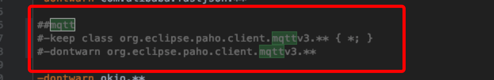

# Upgrade guide

If you have integrated the previous version and want to upgrade to version 3.14.x, please refer to the following steps:

Update the version of the wisersmart library to the version corresponding to 3.14.x

1. Remove dependencies of paho mqtt library

	```groovy
	implementation 'org.eclipse.paho:org.eclipse.paho.client.mqttv3:1.2.0'
	```

	

2. Remove proguard rules from paho library

	```
	-keep class org.eclipse.paho.client.mqttv3.** { *; }
	-dontwarn org.eclipse.paho.client.mqttv3.**
	```

	

3. Added proguard rules

	```
	#mqtt
	-keep class com.wiser.smart.mqttclient.mqttv3.** { *; }
	-dontwarn com.wiser.smart.mqttclient.mqttv3.**
	```

4. Update OkHttp client version

		```groovy
	implementation 'com.squareup.okhttp3:okhttp-urlconnection:3.12.3'
	```
	
	change okhttp proguard rules
	
	```
	#OkHttp3
	-keep class okhttp3.** { *; }
	-keep interface okhttp3.** { *; }
	-dontwarn okhttp3.**
	
	-keep class okio.** { *; }
	-dontwarn okio.**
	```
	
	
