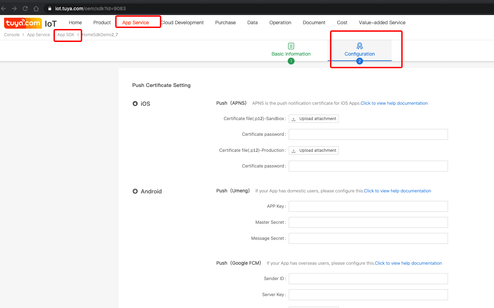
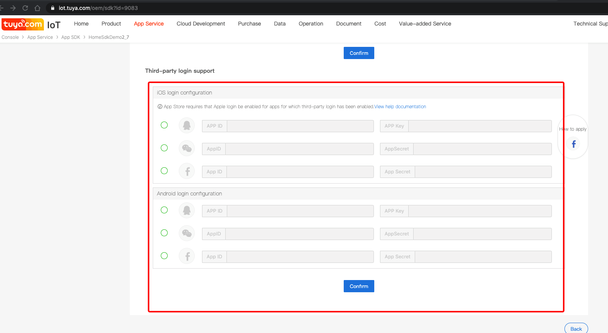

## Using Platform of a Third Party for Login

The third-party login needs to configure the corresponding third-party configuration information on the wiser iot platform, otherwise, calling the following interface will fail.






## Login on Facebook

**Declaration**

```java
WiserHomeSdk.getUserInstance().loginByFacebook(String phoneCode, String token, ILoginCallback callback);
```

**Parameters**

|  Parameters        | Description                        |
| ----------- | --------------------------- |
| phoneCode | phone code,such as：86           |
| token       |The Token that authorizes login on Facebook. |
